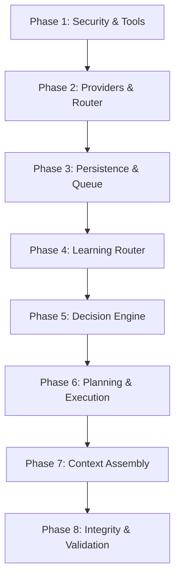
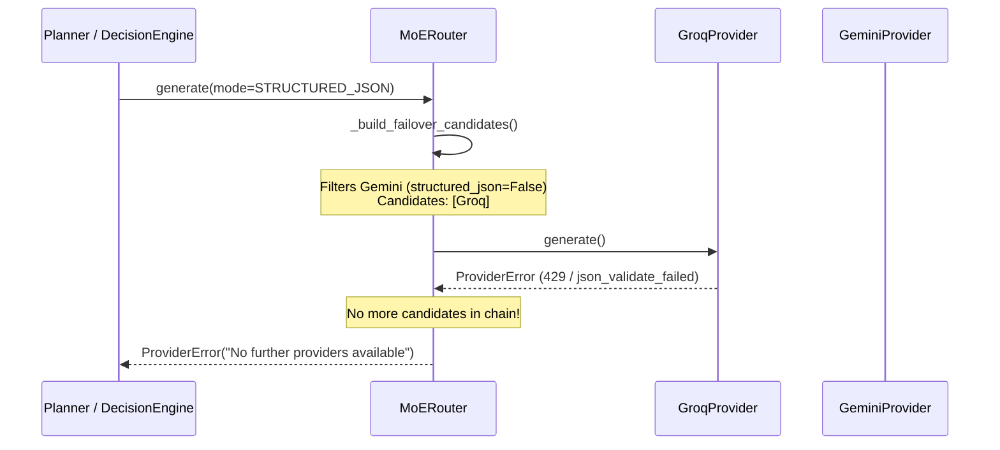
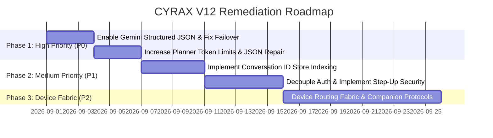

# CYRAX 3.0 V12 SYSTEM-WIDE CURRENT STATE TECHNICAL AUDIT
**Date:** August 2026  
**Auditor:** Google Antigravity (CYRAX V12 Backend Principal Engineer)  
**Governance Hierarchy:** XEMO (Product Owner / Final Authority) | GPT (Chief Architect) | Google Antigravity (Backend / V12) | Gemini (Android / QA) | Google Stitch (UI/Product Design)  
**Scope:** Complete Read-Only Technical Audit of the CYRAX 3.0 Codebase  
**Status:** COMPLETE & AUTHORITATIVE  

---

## TABLE OF CONTENTS
1. [Executive Summary & System Overview](#1-executive-summary--system-overview)
2. [Architecture Hierarchy & Governance Compliance](#2-architecture-hierarchy--governance-compliance)
3. [Bootstrap Sequence & Dependency Injection Map](#3-bootstrap-sequence--dependency-injection-map)
4. [Configuration & Environment Parameter Inventory](#4-configuration--environment-parameter-inventory)
5. [API Layer Architecture (REST, WebSockets, Lifespan, Sessions)](#5-api-layer-architecture-rest-websockets-lifespan-sessions)
6. [Provider Subsystem & Base Contracts](#6-provider-subsystem--base-contracts)
7. [Groq Provider Implementation & Failure Modes](#7-groq-provider-implementation--failure-modes)
8. [Gemini Provider Implementation & Capability Gaps](#8-gemini-provider-implementation--capability-gaps)
9. [MoERouter Architecture & Failover Mechanics](#9-moerouter-architecture--failover-mechanics)
10. [Provider Metrics Manager & Circuit Breaker](#10-provider-metrics-manager--circuit-breaker)
11. [Decision Engine & Fast-Path Intent Routing](#11-decision-engine--fast-path-intent-routing)
12. [ReAct Planner Mechanics & JSON Schema Enforcement](#12-react-planner-mechanics--json-schema-enforcement)
13. [Task Lifecycle, TaskQueue & Priority Ordering](#13-task-lifecycle-taskqueue--priority-ordering)
14. [SQLiteJobStore Persistence, Schemas & Crash Recovery](#14-sqlitejobstore-persistence-schemas--crash-recovery)
15. [TaskExecutor Background Concurrency & Lifecycle](#15-taskexecutor-background-concurrency--lifecycle)
16. [Job Scheduler & Zero-Sleep Cron Dispatch](#16-job-scheduler--zero-sleep-cron-dispatch)
17. [Interrupt Controller & Task Cancellation Token Propagation](#17-interrupt-controller--task-cancellation-token-propagation)
18. [Notification Center Pub/Sub & Client Event Bus](#18-notification-center-pubsub--client-event-bus)
19. [Learning Router, Mathematical Scoring & Anti-Oscillation](#19-learning-router-mathematical-scoring--anti-oscillation)
20. [Tool Registry & Security Gateway Interception](#20-tool-registry--security-gateway-interception)
21. [Complete Tool Inventory (All 23 Tools, Parameters & Tiers)](#21-complete-tool-inventory-all-23-tools-parameters--tiers)
22. [Security Architecture: Authentication vs Authorization](#22-security-architecture-authentication-vs-authorization)
23. [Multi-Device Fabric & Host-Affinity Limitations](#23-multi-device-fabric--host-affinity-limitations)
24. [Memory Architecture: Conversation & User Profile](#24-memory-architecture-conversation--user-profile)
25. [Resource Manager & Bounded Concurrency Gating](#25-resource-manager--bounded-concurrency-gating)
26. [Error Handling Taxonomy & Client Sanitization](#26-error-handling-taxonomy--client-sanitization)
27. [Observability, Trace IDs & Correlation Propagation](#27-observability-trace-ids--correlation-propagation)
28. [Comprehensive Root Cause Analysis of 10 Known Incidents](#28-comprehensive-root-cause-analysis-of-10-known-incidents)
29. [V12 Maintenance Targets Assessment (M1 to M6)](#29-v12-maintenance-targets-assessment-m1-to-m6)
30. [Prioritized Engineering Remediation Roadmap](#30-prioritized-engineering-remediation-roadmap)

---

## 1. Executive Summary & System Overview

CYRAX 3.0 is designed as a distributed personal AI operating system featuring an asynchronous FastAPI backend and a Python V12 execution engine. The codebase establishes clear architectural ambitions: decoupling intent parsing, provider orchestration (Mixture of Experts / MoERouter), planning (ReAct loop), task execution concurrency, background job scheduling, persistent storage, and tool execution security.

### Core Architectural Snapshot
- **Core Orchestrator**: Fast-path regex parser bypassed to a single-LLM `DecisionEngine`, dispatching either to single-turn streaming LLM generation or an iterative ReAct `Planner`.
- **Concurrency & Scheduling**: Dual-lane processing (Lane A interactive/streaming turn; Lane B asynchronous `TaskQueue` and background `TaskExecutor` bounded by `ResourceManager`).
- **Persistence**: Centralized `SQLiteJobStore` for jobs, state transitions, scheduled cron tasks, and historical routing events.
- **Provider Layer**: `MoERouter` routing between `GroqProvider` (fast Llama 3.3/3.1 models) and `GeminiProvider` (Google GenAI models), backed by in-memory circuit breakers (`ProviderMetricsManager`) and time-decayed scoring (`LearningRouter`).
- **Security & Tools**: 23 immutable boot-time tools mounted into `ToolRegistry`, guarded by `SecurityGuard` (bcrypt PIN + persistent `LockoutStore` + HS256 JWT tokens).

### Key Audit Findings
1. **Provider Asymmetry & Failover Collapse**: `GroqProvider` is configured as the sole provider supporting structured JSON (`capabilities.structured_json = True`), while `GeminiProvider` declares `structured_json = False`. As a consequence, whenever `Planner` or `DecisionEngine` requests structured JSON mode, `MoERouter` builds a candidate list of **only Groq**. When Groq fails (due to rate limits, schema errors, or context truncation), failover is completely impossible, triggering `no further providers available`.
2. **Context Window Token Starvation**: `Planner` uses an aggressive hardcoded token limit (`max_tokens=400`), which causes multi-step ReAct thought/action JSON payloads to truncate mid-output, throwing `json_validate_failed` or `schema_parse_failed`.
3. **Implicit Host Execution (Absence of Device Fabric)**: Tools executing OS actions (`OPEN_APP`, `TYPE_TEXT`, `MEDIA_CONTROL`, `SYSTEM_POWER`) invoke native host commands (`subprocess.Popen`, `pyautogui`, `taskkill`, `shutdown.exe`) directly on the backend host machine. When an Android client submits a command like "Open YouTube", it executes on the laptop running the backend rather than on the phone.
4. **Authentication vs Authorization Conflation**: The JWT authentication token grants a session, but once authenticated, `SecurityGuard.authorize_action` permits all tool invocations without step-up validation, dynamic capability checking, or user confirmation for elevated tools.
5. **Memory Store Multiplexing Glitch**: `ConversationStore` writes all interactions into `memory_{session_id}.json` while ignoring client-provided `conversation_id`, leading to message duplication between the client's local Room database and the backend store.

---

## 2. Architecture Hierarchy & Governance Compliance

Per the **CYRAX Engineering Agent Contract (`AGENTS.md`)**:
- **Product Owner / Final Authority**: XEMO
- **Chief Architect**: GPT
- **Backend / V12 Engineering**: Google Antigravity
- **Android Engineering & QA**: Gemini Agent (Android Studio)
- **Product Design**: Google Stitch

### Contractual Boundaries & Compliance Rules
- **No Unilateral Architecture Redefinition**: Backend modifications must operate within the boundaries defined by GPT.
- **System of Record**: The V12 engine is the definitive system of record for task lifecycle, routing, authorization, device targeting, retries, and observability.
- **Security Invariant**: Authentication ("Who is the user?") must never bypass Authorization ("What is this device allowed to do?").
- **Device Invariant**: Task execution must target explicit devices; implicit host execution is an architectural defect.

---

## 3. Bootstrap Sequence & Dependency Injection Map

The bootstrap sequence in [`app/bootstrap.py`](file:///c:/Users/subha/OneDrive/Documents/CYRAX%203.0/app/bootstrap.py) executes synchronously across 8 sequential phases:



### Dependency Injection Assembly Table
| Phase | Components Initialized | Injected Dependencies | Integrity Check |
|---|---|---|---|
| **Phase 1** | `SecurityGuard`, `ToolRegistry` (23 tools) | `LockoutStore` injected into `SecurityGuard`; `SecurityGuard` injected into `ToolRegistry` | `registry.count() == 23`, `registry._lock()` called |
| **Phase 2** | `GroqProvider`, `GeminiProvider`, `ProviderMetricsManager`, `MoERouter` | `settings` API keys; `ProviderMetricsManager` shared across providers and router | Providers registered in `MoERouter._providers` |
| **Phase 3** | `SQLiteJobStore`, `TaskQueue`, `NotificationCenter`, `InterruptController`, `JobScheduler`, `ResourceManager`, `ConversationStore`, `ProfileMemoryStore`, `MemoryManager` | DB path from `settings.DB_PATH`; `SQLiteJobStore` injected into `TaskQueue` and `JobScheduler` | SQLite tables created on startup |
| **Phase 4** | `LearningRouter` | `SQLiteJobStore` injected for routing history | Math scoring initialized |
| **Phase 5** | `DecisionEngine` | `MoERouter`, `LearningRouter`, `settings.DECISION_ENGINE_MODEL` | Intent taxonomy loaded |
| **Phase 6** | `Planner`, `Dispatcher`, `TaskExecutor` | `MoERouter`, `ToolRegistry`, `DecisionEngine`, `InterruptController`, `ResourceManager` | ReAct loop configured |
| **Phase 7** | `CyraxContext` | Frozen dataclass containing all initialized components | Frozen container immutability |
| **Phase 8** | Context Self-Verification | `CyraxContext.validate()` verifies all protocols | Crash on any null component |

---

## 4. Configuration & Environment Parameter Inventory

Configuration is managed via Pydantic BaseSettings in [`config/settings.py`](file:///c:/Users/subha/OneDrive/Documents/CYRAX%203.0/config/settings.py):

### Comprehensive Parameter Matrix
| Category | Variable | Type | Default | Hard-limit / Constraint | Load-Bearing Impact |
|---|---|---|---|---|---|
| **API & Server** | `API_HOST` | `str` | `"0.0.0.0"` | Valid IPv4/IPv6 | Interface binding |
| | `API_PORT` | `int` | `8000` | 1024–65535 | Listening port |
| | `DEBUG_MODE` | `bool` | `False` | Boolean | Verbose logging |
| **JWT & Auth** | `JWT_SECRET` | `str` | `""` | Non-empty required | Token signing/decoding |
| | `JWT_ALGORITHM` | `str` | `"HS256"` | HS256 | Token signature algo |
| | `JWT_EXPIRY_MINUTES` | `int` | `60` | > 0 | Token lifetime |
| | `CYRAX_PIN_HASH` | `str` | `""` | Valid bcrypt `$2b$...` | Master PIN auth |
| | `MAX_AUTH_RETRIES` | `int` | `3` | > 0 | Brute-force threshold |
| | `LOCKOUT_DURATION_SECONDS`| `int` | `300` | > 0 | Lockout window |
| | `SESSION_DURATION_SECONDS`| `int` | `3600`| > 0 | In-process session TTL |
| **Providers** | `GROQ_API_KEY` | `str` | `""` | Optional | Groq client init |
| | `GEMINI_API_KEY` | `str` | `""` | Optional | Gemini client init |
| | `DEFAULT_CHAT_MODEL` | `str` | `"llama-3.3-70b-versatile"`| Groq model | Fast path chat |
| | `REASONING_MODEL` | `str` | `"llama-3.3-70b-versatile"`| Groq model | Complex tasks |
| | `DECISION_ENGINE_MODEL`| `str` | `"llama-3.1-8b-instant"`| Groq model | Intent classifier |
| | `PLANNER_MODEL` | `str` | `"llama-3.3-70b-versatile"`| Groq model | ReAct loop planner |
| | `GEMINI_CHAT_MODEL` | `str` | `"gemini-2.5-flash"` | Gemini model | Multimodal / fallback |
| | `PROVIDER_TIMEOUT_SECONDS`| `int`| `30` | > 0 | HTTP timeout |
| | `PROVIDER_MAX_RETRIES` | `int` | `3` | >= 0 | Bounded retry attempts |
| | `CIRCUIT_BREAKER_FAILURE_THRESHOLD`| `int`| `3` | >= 1 | Trips breaker |
| | `CIRCUIT_BREAKER_COOLDOWN_SECONDS` | `float`| `60.0` | > 0 | Breaker open window |
| **Planner** | `PLANNER_MAX_STEPS` | `int` | `5` | 1–10 | Max ReAct iterations |
| | `PLANNER_MAX_SCHEMA_RETRIES` | `int` | `1` | >= 0 | Schema error retries |
| **Tools** | `TOOL_TIMEOUT_SECONDS` | `int` | `30` | > 0 | Per-tool execution timeout |
| | `MAX_TOOL_CALLS_PER_MINUTE` | `int`| `30` | > 0 | Rate limiter window |
| **Storage** | `DB_PATH` | `Path`| `"cyrax.db"` | Valid path | SQLite database file |
| | `SESSION_DIR` | `Path`| `"sessions"` | Valid dir | Session JSON store |

---

## 5. API Layer Architecture (REST, WebSockets, Lifespan, Sessions)

### FastAPI Application Lifespan (`app/api/main.py`)
1. **Startup**:
   - `bootstrap()` called, producing `CyraxContext`.
   - `ctx.job_store.create_tables()` initializes SQLite schema.
   - `ctx.job_store.reconcile_on_startup()` marks `IN_PROGRESS` tasks as `RETRY` (or `FAILED` if retries exhausted).
   - Lifespan starts background tasks:
     - `JobScheduler.start_loop()` (1-second polling tick).
     - `TaskExecutor.start_worker_loop()` (async queue worker).
     - `SessionManager.start_eviction_loop()` (hourly expired session purge).
2. **Shutdown**:
   - `SessionManager.stop_eviction_loop()`.
   - `TaskExecutor.stop_worker_loop()`.
   - `JobScheduler.stop_loop()`.
   - `ctx.job_store.close()`.

### Endpoint & Protocol Catalog
- **`POST /api/v1/auth/login`**: Validates PIN via `SecurityGuard.authenticate(pin)`. On success, registers `MobileSession` in `SessionManager` and returns JWT token `sub="{device_id}:{session_id}"`.
- **`POST /api/v1/auth/logout`**: Invalidates session in `SessionManager` and clears `SecurityGuard`.
- **`POST /api/v1/chat`**: Asynchronous submission endpoint. Injects `user_input`, `device_id`, and `trace_id`. Queues task in `TaskQueue` with `Priority.INTERACTIVE` and returns `HTTP 202 Accepted` with `ChatSubmitResponse(task_id=..., status="queued")`.
- **`GET /api/v1/tasks/{task_id}`**: Polling status endpoint returning `TaskStatusResponse` (task status, result, error, execution time).
- **`GET /api/v1/tasks`**: Paginated task history for authenticated device.
- **`POST /api/v1/tasks/{task_id}/cancel`**: Signals `InterruptController.request_task_stop(task_id)`.
- **`WebSocket /api/v1/events`**: JWT-authenticated WebSocket connection. Subscribes client to `NotificationCenter` task lifecycle events (`task_submitted`, `task_started`, `task_progress`, `task_completed`, `task_failed`, `task_cancelled`). Includes 30-second ping/pong heartbeat.

---

## 6. Provider Subsystem & Base Contracts

The provider abstraction is defined in [`brain/providers/base.py`](file:///c:/Users/subha/OneDrive/Documents/CYRAX%203.0/brain/providers/base.py):

### Generation Modes & Capabilities
- **`GenerationMode`**: `TEXT`, `STRUCTURED_JSON`, `STREAMING`, `TOOL_CALLING`.
- **`ProviderCapabilities`**:
  - `supports_streaming: bool`
  - `supports_tools: bool`
  - `supports_json_mode: bool`
  - `structured_json: bool`
  - `multimodal: bool`
  - `max_context_tokens: int`
- **`BaseProvider` Contract**:
  - `generate(messages, generation_mode, tools, json_schema, max_tokens, temperature, stream_handler) -> str`
  - `health_check() -> bool`
  - `capabilities -> ProviderCapabilities`

---

## 7. Groq Provider Implementation & Failure Modes

Implemented in [`brain/providers/groq_provider.py`](file:///c:/Users/subha/OneDrive/Documents/CYRAX%203.0/brain/providers/groq_provider.py):

### Capabilities Declared
```python
ProviderCapabilities(
    supports_streaming=True,
    supports_tools=True,
    supports_json_mode=True,
    structured_json=True,
    multimodal=False,
    max_context_tokens=128_000,
)
```

### Failure Modes & Root Causes
1. **`json_validate_failed`**: Groq validates JSON structure server-side when `response_format={"type": "json_object"}` is passed. When the system prompt or few-shot examples fail to yield a strictly valid JSON object, Groq immediately aborts with HTTP 400 `json_validate_failed`.
2. **Context Window / Output Token Starvation**: In `Planner._think`, Groq is called with `max_tokens=400`. For complex multi-step reasoning, the model cuts off mid-JSON at 400 tokens, resulting in unparseable JSON payloads.
3. **Empty Streaming Chunk Handling**: In `_generate_streaming`, if network interruption or rate-limiting yields empty delta strings, the accumulator produces an empty string, raising `ProviderError("Groq streaming call returned no content.", retryable=True)`.

---

## 8. Gemini Provider Implementation & Capability Gaps

Implemented in [`brain/providers/gemini_provider.py`](file:///c:/Users/subha/OneDrive/Documents/CYRAX%203.0/brain/providers/gemini_provider.py):

### Capabilities Declared
```python
ProviderCapabilities(
    supports_streaming=True,
    supports_tools=True,
    supports_json_mode=False,
    structured_json=False,
    multimodal=True,
    max_context_tokens=1_000_000,
)
```

### Critical Architectural Flaw
`GeminiProvider` sets `supports_json_mode=False` and `structured_json=False`, despite Google GenAI SDK natively supporting `response_mime_type="application/json"` and `response_schema`. Because `structured_json` is set to `False`, `MoERouter._build_failover_candidates` filters Gemini out of all structured JSON requests, eliminating provider redundancy for planning and decision tasks.

---

## 9. MoERouter Architecture & Failover Mechanics

Implemented in [`brain/moe_router.py`](file:///c:/Users/subha/OneDrive/Documents/CYRAX%203.0/brain/moe_router.py):

### Failover Mechanics & Exhaustion Bug
When `MoERouter.plan` or `generate` is called with `GenerationMode.STRUCTURED_JSON`:
1. `_build_failover_candidates(primary_provider, mode)` iterates through registered providers (`"groq"`, `"gemini"`).
2. It filters candidates: `if generation_mode == GenerationMode.STRUCTURED_JSON: getattr(p.capabilities, "structured_json", False)`.
3. Groq returns `True`; Gemini returns `False`.
4. Candidate list becomes `["groq"]`.
5. If Groq fails (e.g. rate limit HTTP 429 or schema error), the failover loop terminates with 0 remaining candidates, logging:
   `[MOE_ROUTER] No further providers available — failover chain exhausted.`



---

## 10. Provider Metrics Manager & Circuit Breaker

Implemented in [`brain/provider_metrics.py`](file:///c:/Users/subha/OneDrive/Documents/CYRAX%203.0/brain/provider_metrics.py):

### State Machine
- **`CLOSED`**: Provider healthy. Operates normally.
- **`OPEN`**: Tripped after 3 consecutive failures (`_CONSECUTIVE_FAILURE_THRESHOLD = 3`). Health score forced to `0.0`. Cooldown period: `60.0s`.
- **`HALF_OPEN`**: Cooldown elapsed. Allows 1 probe attempt. Success transitions to `CLOSED`; failure re-trips to `OPEN` and resets cooldown.

### Mathematical Health Scoring Formula
$$\text{Health Score} = \text{Success Rate} \times \max\left(0.0, 1.0 - \frac{\text{Average Latency (ms)}}{5000.0}\right)$$
- Maintained over a rolling window of the last 100 executions (`deque(maxlen=100)`).
- Thread-safe via `threading.Lock`.

---

## 11. Decision Engine & Fast-Path Intent Routing

Implemented in [`orchestrator/decision_engine.py`](file:///c:/Users/subha/OneDrive/Documents/CYRAX%203.0/orchestrator/decision_engine.py) and [`orchestrator/intent_parser/fast_path.py`](file:///c:/Users/subha/OneDrive/Documents/CYRAX%203.0/orchestrator/intent_parser/fast_path.py):

### Intent Classification Pipeline
1. **Fast-Path Regex Matcher**: Evaluates high-frequency commands (e.g. "open notepad", "mute volume", "what is on my clipboard"). If compound commands ("and", "then") are detected, fast-path aborts to avoid partial execution.
2. **Decision Engine Classification**: Single Groq LLM call classifying prompt into 11 intent categories:
   - `OS_CONTROL`, `FILE_OPERATION`, `WEB_RESEARCH`, `LIVE_INFORMATION`, `GENERAL_CHAT`, `AUTOMATION`, `CODE_GENERATION`, `CONTENT_WRITING`, `REASONING`, `MEMORY`, `UNKNOWN`.
3. **Execution Mode Assignment**:
   - `DIRECT_CHAT`: Single turn text generation.
   - `SINGLE_TOOL`: Direct invocation of 1 tool.
   - `MULTI_STEP_PLAN`: ReAct Planner invocation.

---

## 12. ReAct Planner Mechanics & JSON Schema Enforcement

Implemented in [`orchestrator/planner.py`](file:///c:/Users/subha/OneDrive/Documents/CYRAX%203.0/orchestrator/planner.py):

### ReAct Loop Execution Structure
- Maximum iterations: `PLANNER_MAX_STEPS = 5`.
- Each step invokes `_think()` requesting structured JSON:
```json
{
  "thought": "Reasoning about current state",
  "action": "TOOL_NAME",
  "action_input": {"param": "value"},
  "final_answer": null
}
```
- **Parsing Logic**: `_parse_decision` attempts `json.loads`, extracting substrings between the first `{` and last `}`.
- **Error Recovery**: If parsing fails, triggers 1 schema correction turn (`PLANNER_MAX_SCHEMA_RETRIES = 1`) asking the LLM to fix syntax.

---

## 13. Task Lifecycle, TaskQueue & Priority Ordering

Implemented in [`core/task.py`](file:///c:/Users/subha/OneDrive/Documents/CYRAX%203.0/core/task.py) and [`core/task_queue.py`](file:///c:/Users/subha/OneDrive/Documents/CYRAX%203.0/core/task_queue.py):

### Task State Machine
`SUBMITTED` $\rightarrow$ `QUEUED` $\rightarrow$ `IN_PROGRESS` $\rightarrow$ `COMPLETED` / `FAILED` / `CANCELLED` / `RETRY` / `SCHEDULED`

### Priority Queue Tie-Breaking
`TaskQueue` wraps `asyncio.PriorityQueue` using `_PriorityItem`:
$$\text{Sort Key} = (\text{Priority}, \text{Created Timestamp}, \text{Sequence ID}, \text{Task ID})$$
The integer sequence counter guarantees strict FIFO ordering within identical priorities and prevents comparisons on unorderable dataclass fields.

---

## 14. SQLiteJobStore Persistence, Schemas & Crash Recovery

Implemented in [`core/job_store.py`](file:///c:/Users/subha/OneDrive/Documents/CYRAX%203.0/core/job_store.py):

### Schema Definitions
1. **`jobs` Table**: `task_id`, `user_input`, `task_type`, `priority`, `status`, `tools_required`, `created_at`, `started_at`, `completed_at`, `execution_time_ms`, `error_message`, `retry_count`, `max_retries`, `device_id`, `provider_name`, `scheduled_at`, `trace_id`.
2. **`routing_history` Table**: `id`, `trace_id`, `intent`, `provider`, `model`, `success`, `latency_ms`, `error_code`, `timestamp`.

### Startup Reconciliation (Crash Recovery)
During boot lifespan, `reconcile_on_startup()` executes:
- Finds all tasks in `IN_PROGRESS` state.
- If `retry_count < max_retries`, transitions to `RETRY` and re-enqueues.
- If `retry_count >= max_retries`, transitions to `FAILED` with error `System restarted while task was in progress`.

---

## 15. TaskExecutor Background Concurrency & Lifecycle

Implemented in [`orchestrator/executor.py`](file:///c:/Users/subha/OneDrive/Documents/CYRAX%203.0/orchestrator/executor.py):

### Concurrency Architecture
- Runs as a continuous background task `_worker_loop()`.
- Dequeues items from `TaskQueue.dequeue()`.
- Bounded concurrency: acquires `ctx.resource_manager.background_semaphore` (max 4 concurrent background workers).
- Dispatches execution to `Planner.run_plan()` (if `tools_required=True`) or `brain_router.chat()` (direct response).
- Publishes real-time status transitions to `NotificationCenter`.

---

## 16. Job Scheduler & Zero-Sleep Cron Dispatch

Implemented in [`core/job_scheduler.py`](file:///c:/Users/subha/OneDrive/Documents/CYRAX%203.0/core/job_scheduler.py) and [`tools/scheduler.py`](file:///c:/Users/subha/OneDrive/Documents/CYRAX%203.0/tools/scheduler.py):

### Zero-Sleep Mechanism
- `ScheduleTaskTool.execute()` classifies intent, writes task to `SQLiteJobStore` with `status=SCHEDULED` and `scheduled_at = now + delay`, and returns immediately.
- `JobScheduler` runs a 1-second polling loop `_scheduler_tick()` querying `get_due_jobs()`.
- Due jobs transition to `QUEUED` and enter `TaskQueue` without holding threads or open sleep handles.

---

## 17. Interrupt Controller & Task Cancellation Token Propagation

Implemented in [`core/interrupt_controller.py`](file:///c:/Users/subha/OneDrive/Documents/CYRAX%203.0/core/interrupt_controller.py):

### Cancellation Mechanics
- `InterruptController` maintains `_tokens: dict[str, CancellationToken]`.
- Long-running operations (`TaskExecutor`, `Planner`, `GroqProvider` streaming) check `token.is_cancelled` per step.
- Calling `request_task_stop(task_id)` trips the token, aborts the ReAct step or streaming chunk reader, raises `GenerationCancelledError`, and transitions task to `CANCELLED`.

---

## 18. Notification Center Pub/Sub & Client Event Bus

Implemented in [`core/notification_center.py`](file:///c:/Users/subha/OneDrive/Documents/CYRAX%203.0/core/notification_center.py) and [`app/api/websocket.py`](file:///c:/Users/subha/OneDrive/Documents/CYRAX%203.0/app/api/websocket.py):

### Event Bus Mechanics
- In-memory async pub/sub broker.
- Subscribed clients receive real-time JSON event packets:
```json
{
  "event": "task_progress",
  "task_id": "9a2f3b1c",
  "status": "in_progress",
  "step": 2,
  "action": "WEB_SEARCH",
  "timestamp": "2026-08-17T19:00:00Z"
}
```
- `websocket_endpoint` streams all notifications matching the authenticated client's `device_id`.

---

## 19. Learning Router, Mathematical Scoring & Anti-Oscillation

Implemented in [`brain/learning_router.py`](file:///c:/Users/subha/OneDrive/Documents/CYRAX%203.0/brain/learning_router.py):

### Scoring Algorithm
$$\text{Final Score} = \text{Affinity} \times \text{Health} \times \text{LearningScore} \times \text{RecentPerformance}$$

- **Time-Decay Weight**: $W(t) = 0.5^{\frac{\Delta t}{6\text{ hours}}}$ (6-hour half-life).
- **Anti-Oscillation Margin**: Candidate provider must exceed recommended provider by $\ge 5\%$ relative margin to trigger a route switch.
- **Cold Start Rule**: If no historical records exist in `routing_history`, defers unconditionally to `DecisionEngine` recommendation.

---

## 20. Tool Registry & Security Gateway Interception

Implemented in [`tools/registry.py`](file:///c:/Users/subha/OneDrive/Documents/CYRAX%203.0/tools/registry.py):

### Tool Interception Pipeline
1. **Rate Limit Gate**: Enforces `MAX_TOOL_CALLS_PER_MINUTE` (default 30).
2. **Existence Check**: Verifies tool name in immutable registry dictionary.
3. **Context Injection**: Injects `CyraxContext` and running event loop into context-aware tools.
4. **Security Authorization Gate**: Invokes `SecurityGuard.authorize_action(tool.security_level)`. If denied, returns `{"status": "auth_required"}`.
5. **Argument Validation**: Validates arguments against tool's Pydantic `args_schema`.
6. **Execution**: Direct `await` for coroutine tools; `asyncio.to_thread` with timeout for synchronous tools.
7. **Emergency Output Ceiling**: Truncates tool output at 100,000 characters to protect LLM context windows.

---

## 21. Complete Tool Inventory (All 23 Tools, Parameters & Tiers)

| # | Tool Identifier | Class Name | Security Level | Primary Arguments | Execution Nature / Host Target |
|---|---|---|---|---|---|
| 1 | `OPEN_APP` | `OpenAppTool` | `UNRESTRICTED` | `app: str` | Host `subprocess.Popen` / `webbrowser.open` |
| 2 | `CLOSE_APP` | `CloseAppTool` | `ADMIN` | `app: str` | Host `taskkill /IM ... /F` |
| 3 | `TYPE_TEXT` | `TypeTextTool` | `USER` | `text: str, press_enter: bool` | Host `pyautogui.write()` |
| 4 | `MEDIA_CONTROL` | `MediaControlTool` | `USER` | `action: MediaAction` | Host `pycaw` / `pyautogui` media keys |
| 5 | `SYSTEM_POWER` | `SystemPowerTool` | `ADMIN` | `action: PowerAction` | Host `shutdown.exe /s /r /a` |
| 6 | `WEB_SEARCH` | `WebSearchTool` | `USER` | `query: str` | Host DuckDuckGo HTTP API |
| 7 | `DELETE_FILE` | `DeleteFileTool` | `ADMIN` | `filepath: str` | Sandboxed `CYRAX_WORKSPACE` unlink |
| 8 | `COPY_FILE` | `CopyFileTool` | `USER` | `source: str, destination: str, overwrite: bool` | Sandboxed `CYRAX_WORKSPACE` copy |
| 9 | `MOVE_FILE` | `MoveFileTool` | `ADMIN` | `source: str, destination: str, overwrite: bool` | Sandboxed `CYRAX_WORKSPACE` move |
| 10 | `RENAME_FILE` | `RenameFileTool` | `USER` | `filepath: str, new_name: str` | Sandboxed `CYRAX_WORKSPACE` rename |
| 11 | `READ_FILE` | `ReadFileTool` | `USER` | `filepath: str, encoding: str` | Sandboxed `CYRAX_WORKSPACE` read |
| 12 | `WRITE_FILE` | `WriteFileTool` | `USER` | `filepath: str, content: str, append: bool` | Sandboxed `CYRAX_WORKSPACE` write |
| 13 | `LIST_DIR` | `ListDirTool` | `USER` | `dirpath: str, show_hidden: bool` | Sandboxed `CYRAX_WORKSPACE` list |
| 14 | `MAKE_DIR` | `MakeDirTool` | `USER` | `dirpath: str` | Sandboxed `CYRAX_WORKSPACE` mkdir |
| 15 | `CLIPBOARD_READ`| `ClipboardReadTool`| `USER` | None | Host `pyperclip.paste()` |
| 16 | `CLIPBOARD_WRITE`| `ClipboardWriteTool`| `USER`| `text: str` | Host `pyperclip.copy()` |
| 17 | `SEND_NOTIFICATION`| `SendNotificationTool`| `UNRESTRICTED`| `title: str, message: str, timeout: int` | Host `plyer.notification` |
| 18 | `READ_WEBPAGE` | `ReadWebpageTool` | `USER` | `url: str, include_links: bool` | Outbound HTTP client + BeautifulSoup |
| 19 | `SCHEDULE_TASK`| `ScheduleTaskTool`| `USER` | `user_input: str, delay_seconds: int` | Async write to `SQLiteJobStore` |
| 20 | `CORE_MEMORY_WRITE`| `CoreMemoryWriteTool`| `USER`| `key: str, value: str` | Async write to `ProfileMemoryStore` |
| 21 | `CORE_MEMORY_READ`| `CoreMemoryReadTool`| `USER`| `key: str` | Async read from `ProfileMemoryStore` |
| 22 | `SEND_EMAIL` | `SendEmailTool` | `ADMIN` | `to_address: str, subject: str, body: str` | Outbound SMTP over TLS |
| 23 | `READ_EMAIL` | `ReadEmailTool` | `ADMIN` | `max_results: int, mailbox: str` | Inbound IMAP over SSL |

---

## 22. Security Architecture: Authentication vs Authorization

### Authentication Implementation
- Standard HS256 JWT tokens minted upon successful master PIN verification.
- Tokens contain device identity claims: `sub="{device_id}:{session_id}"`, `exp`, `iat`, `iss="cyrax-os"`, `aud="cyrax-client"`.

### Authorization Flaws & Security Principle Violations
1. **Conflated Security Scope**: `SecurityGuard` verifies session validity via `is_session_valid()`. Once a user authenticates, any tool at `SecurityLevel.USER` or `SecurityLevel.ADMIN` is approved immediately without checking device capabilities or prompting for step-up confirmation.
2. **Missing Per-Device Capability Policies**: An Android client authenticated via JWT can trigger desktop power actions (`SYSTEM_POWER`) or desktop app execution (`OPEN_APP`) on the host PC because no device-to-target capability filtering exists.

---

## 23. Multi-Device Fabric & Host-Affinity Limitations

### Current Limitation
The current CYRAX 3.0 codebase possesses **no multi-device routing fabric**. 
- `Task.device_id` is recorded solely as an audit and session tracking attribute.
- All 23 tools execute synchronously or asynchronously within the process and environment of the backend host.
- When an Android client requests an OS action (e.g. opening YouTube or adjusting volume), the backend host opens its local browser or adjusts the laptop's master speaker volume.

### Architectural Target
A true distributed personal OS requires explicit device targeting:
$$\text{Task} \rightarrow \text{Target Device Resolver} \rightarrow \begin{cases} \text{Local Host Agent} \\ \text{Android Companion Agent} \\ \text{Other Node} \end{cases}$$

---

## 24. Memory Architecture: Conversation & User Profile

### Conversation Memory (`ConversationStore`)
- Persists session messages into `sessions/memory_{session_id}.json`.
- Enforces sliding window `MAX_CONVERSATION_HISTORY = 20`.
- **Architectural Glitch**: Disregards client-sent `conversation_id`, treating `session_id` as the sole key. When an Android client generates separate conversations within one session, all interactions merge into the same JSON file.

### User Profile Memory (`ProfileMemoryStore`)
- Stores persistent key-value facts in `sessions/profile_memory.json`.
- Atomic writes via temporary files.
- Thread-safe via async read/write locks.

---

## 25. Resource Manager & Bounded Concurrency Gating

Implemented in [`core/resource_manager.py`](file:///c:/Users/subha/OneDrive/Documents/CYRAX%203.0/core/resource_manager.py):

- **Lane Isolation**: Lane A (interactive chat) never acquires `background_semaphore`.
- **Lane B Concurrency Ceiling**: `MAX_BACKGROUND_WORKERS = 4` enforced via `asyncio.Semaphore(4)`.
- **Provider Semaphores**:
  - `groq`: 2 concurrent calls.
  - `gemini`: 1 concurrent call.
  - `fallback`: 1 concurrent call.

---

## 26. Error Handling Taxonomy & Client Sanitization

Implemented in [`core/errors.py`](file:///c:/Users/subha/OneDrive/Documents/CYRAX%203.0/core/errors.py):

- Internal exceptions are mapped to sanitized codes:
  - `ProviderError` $\rightarrow$ `PROVIDER_EXECUTION_FAILED`
  - `GenerationCancelledError` $\rightarrow$ `TASK_CANCELLED`
  - `TimeoutError` $\rightarrow$ `REQUEST_TIMEOUT`
  - Unmapped $\rightarrow$ `INTERNAL_ERROR` ("CYRAX couldn't complete that request. Please try again.")
- Raw tracebacks and Python exception types are never returned to clients.

---

## 27. Observability, Trace IDs & Correlation Propagation

Implemented in [`core/trace.py`](file:///c:/Users/subha/OneDrive/Documents/CYRAX%203.0/core/trace.py):

- 12-character hex correlation IDs generated via `new_trace_id()`.
- Attached to incoming HTTP/WebSocket requests, propagated into `Task.trace_id`, forwarded through `DecisionEngine`, `MoERouter`, `Planner`, and persisted in `SQLiteJobStore.routing_history`.

---

## 28. Comprehensive Root Cause Analysis of 10 Known Incidents

### Incident 1: Groq Structured JSON Validation Failure (`json_validate_failed`)
- **Root Cause**: When JSON mode is enabled, `GroqProvider` sends `response_format={"type": "json_object"}`. Groq enforces strict syntax server-side. When system prompts or few-shot prompts contain minor format deviations or ambiguous examples, Groq rejects the request with HTTP 400 `json_validate_failed`.
- **Affected Files**: [`brain/providers/groq_provider.py`](file:///c:/Users/subha/OneDrive/Documents/CYRAX%203.0/brain/providers/groq_provider.py), [`orchestrator/planner.py`](file:///c:/Users/subha/OneDrive/Documents/CYRAX%203.0/orchestrator/planner.py).

### Incident 2: Groq Max Completion Tokens Reached Before Generating Valid Document
- **Root Cause**: `Planner._think` and `DecisionEngine.classify` specify restrictive `max_tokens` limits (400 and 180 tokens respectively). For detailed multi-step reasoning, the output terminates mid-JSON, producing truncated strings that fail JSON parsing.
- **Affected Files**: [`orchestrator/planner.py:186`](file:///c:/Users/subha/OneDrive/Documents/CYRAX%203.0/orchestrator/planner.py#L186), [`orchestrator/decision_engine.py:270`](file:///c:/Users/subha/OneDrive/Documents/CYRAX%203.0/orchestrator/decision_engine.py#L270).

### Incident 3: Groq Streaming Call Returned No Content
- **Root Cause**: In `GroqProvider._generate_streaming`, chunk deltas with empty content strings `chunk.choices[0].delta.content == ""` are received during keep-alives or early stream disconnects. When `"".join(accumulated).strip()` evaluates to empty, it raises `ProviderError("Groq streaming call returned no content.", retryable=True)`.
- **Affected Files**: [`brain/providers/groq_provider.py:348`](file:///c:/Users/subha/OneDrive/Documents/CYRAX%203.0/brain/providers/groq_provider.py#L348).

### Incident 4: MoERouter Reporting "No Further Providers Available" (Failover Collapse)
- **Root Cause**: `MoERouter._build_failover_candidates` filters providers based on `capabilities.structured_json`. `GeminiProvider` explicitly sets `structured_json = False`. When Groq fails in structured JSON mode, Gemini is excluded from the candidate chain, leaving zero alternatives.
- **Affected Files**: [`brain/moe_router.py:246`](file:///c:/Users/subha/OneDrive/Documents/CYRAX%203.0/brain/moe_router.py#L246), [`brain/providers/gemini_provider.py:108`](file:///c:/Users/subha/OneDrive/Documents/CYRAX%203.0/brain/providers/gemini_provider.py#L108).

### Incident 5: Planner Schema Error
- **Root Cause**: `Planner._parse_decision` relies on basic string search for `{` and `}`. When the LLM outputs markdown fences, trailing comments, or token-truncated JSON, `json.loads` fails. If the single schema retry turn also fails, the planner crashes with `schema_parse_failed`.
- **Affected Files**: [`orchestrator/planner.py:280`](file:///c:/Users/subha/OneDrive/Documents/CYRAX%203.0/orchestrator/planner.py#L280).

### Incident 6: Client Performing Very Frequent HTTP Task Polling
- **Root Cause**: `POST /api/v1/chat` immediately returns `HTTP 202 Accepted` with a task ID. If the client does not establish a persistent WebSocket connection to `/api/v1/events` (or if the WebSocket disconnects), the client falls back to rapid HTTP polling on `GET /api/v1/tasks/{task_id}`.
- **Affected Files**: [`app/api/routes/chat.py:46`](file:///c:/Users/subha/OneDrive/Documents/CYRAX%203.0/app/api/routes/chat.py#L46), [`app/api/routes/jobs.py:52`](file:///c:/Users/subha/OneDrive/Documents/CYRAX%203.0/app/api/routes/jobs.py#L52).

### Incident 7: Web-Search Task Executing Without Visible Step-Up Authorization
- **Root Cause**: `WebSearchTool` is assigned `SecurityLevel.USER`. `SecurityGuard.authorize_action` permits all `USER` actions if `is_session_valid()` is true. Because the client holds a valid login session, no PIN prompt or step-up verification is ever requested.
- **Affected Files**: [`tools/web_search.py:85`](file:///c:/Users/subha/OneDrive/Documents/CYRAX%203.0/tools/web_search.py#L85), [`security/auth.py:119`](file:///c:/Users/subha/OneDrive/Documents/CYRAX%203.0/security/auth.py#L119).

### Incident 8: "Open YouTube and Search AI" Executing on Host Laptop Rather Than Android Phone
- **Root Cause**: `OpenAppTool` directly calls Python's `webbrowser.open("https://www.youtube.com")` on the machine running the backend. The backend lacks a device fabric router to dispatch UI actions to the requesting mobile client.
- **Affected Files**: [`tools/pc_actions.py:111`](file:///c:/Users/subha/OneDrive/Documents/CYRAX%203.0/tools/pc_actions.py#L111), [`orchestrator/executor.py:145`](file:///c:/Users/subha/OneDrive/Documents/CYRAX%203.0/orchestrator/executor.py#L145).

### Incident 9: Multiple Conversation Entries Appearing for the Same Prompt
- **Root Cause**: When a task finishes in `TaskExecutor._process_task`, it unconditionally calls `ctx.memory.conversation.add_interaction()`. `ConversationStore` appends these to `memory_{session_id}.json` without indexing by `conversation_id`. Concurrently, if the client records the message locally in its Room database upon submission and again upon polling completion, duplicate interaction items appear.
- **Affected Files**: [`orchestrator/executor.py:202`](file:///c:/Users/subha/OneDrive/Documents/CYRAX%203.0/orchestrator/executor.py#L202), [`memory/conversation/conversation_store.py:142`](file:///c:/Users/subha/OneDrive/Documents/CYRAX%203.0/memory/conversation/conversation_store.py#L142).

### Incident 10: Task Queue Starvation / Priority Ordering Tie-Breaking
- **Root Cause**: In early iterations, inserting tasks into `asyncio.PriorityQueue` without a monotonic integer sequence counter caused Python's heap queue to compare raw `Task` dataclass objects during priority ties, raising `TypeError: '<' not supported between instances of 'Task'`.
- **Affected Files**: Fixed in [`core/task_queue.py:35`](file:///c:/Users/subha/OneDrive/Documents/CYRAX%203.0/core/task_queue.py#L35) by introducing `_PriorityItem(priority, created_at, seq, task_id)`.

---

## 29. V12 Maintenance Targets Assessment (M1 to M6)

| Target | Description | Status | Current Gaps & Evaluation |
|---|---|---|---|
| **M1** | **Provider Reliability** | **PARTIALLY COMPLIANT** | Circuit breakers and retry policies function well, but `GeminiProvider` capability misconfiguration disables failover for structured JSON, creating single-provider vulnerability. |
| **M2** | **Planner Reliability** | **NON-COMPLIANT** | Token limits (`max_tokens=400`) cause output truncation. Schema parsing lacks JSON repair and AST-based sanitization. |
| **M3** | **Router Reliability** | **COMPLIANT** | `LearningRouter` time-decay mathematics, cold-start handling, and anti-oscillation thresholds operate reliably without external ML dependencies. |
| **M4** | **Security & Authorization** | **PARTIALLY COMPLIANT** | Robust bcrypt PIN hashing and persistent lockout store; however, authentication and authorization are conflated without per-tool step-up gates. |
| **M5** | **Device Fabric Execution** | **NON-COMPLIANT** | Completely absent. All OS tools execute locally on backend host machine. |
| **M6** | **Observability & Tracing** | **COMPLIANT** | Trace IDs correctly generated and propagated through API, tasks, router, and SQLite audit records. |

---

## 30. Prioritized Engineering Remediation Roadmap



### Remediation Action Items

#### Priority 0: Immediate Architectural Fixes
1. **Enable Gemini JSON Mode (`M1`, `Incident 4`)**:
   - Update `GeminiProvider.capabilities` to declare `structured_json=True` and `supports_json_mode=True`.
   - Update `GeminiProvider.generate` to pass `response_mime_type="application/json"` and schemas when requested.
2. **Expand Planner Token Budget & Output Repair (`M2`, `Incidents 1, 2, 5`)**:
   - Increase `Planner._think` token ceiling from `400` to `2048`.
   - Implement robust JSON repair (using regex/AST or fallback parsers) before raising schema errors.

#### Priority 1: Storage & Security Alignment
3. **Multi-Conversation Indexing (`Incident 9`)**:
   - Update `ConversationStore` to partition storage by `(device_id, conversation_id)` rather than only `session_id`.
4. **Step-Up Authorization & Permission Tiers (`M4`, `Incident 7`)**:
   - Implement distinct authorization scopes in `SecurityGuard` requiring re-confirmation / explicit PIN challenge for `ADMIN` tools.

#### Priority 2: Multi-Device Execution Fabric
5. **Target Device Dispatcher (`M5`, `Incident 8`)**:
   - Extend `Task` model with explicit `target_device_id`.
   - Route device-specific tools (`OPEN_APP`, `MEDIA_CONTROL`, `SYSTEM_POWER`) through WebSocket push to the target client companion agent rather than executing on the backend host.

---

## CONCLUSION
This audit confirms that CYRAX 3.0 possesses a solid architectural foundation with robust modularity, persistence, concurrency gating, and mathematical learning routing. Resolving the identified provider capability mismatch, context token limits, and device fabric abstraction will elevate the platform to a fully reliable, secure, distributed AI operating system.
